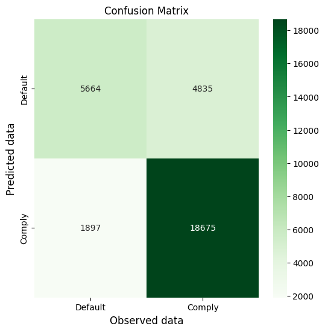
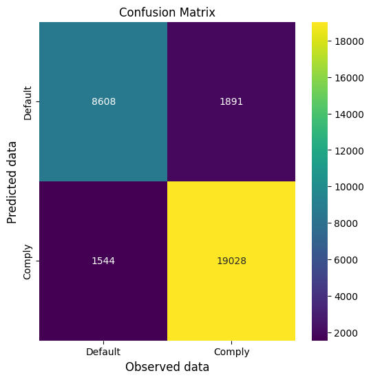
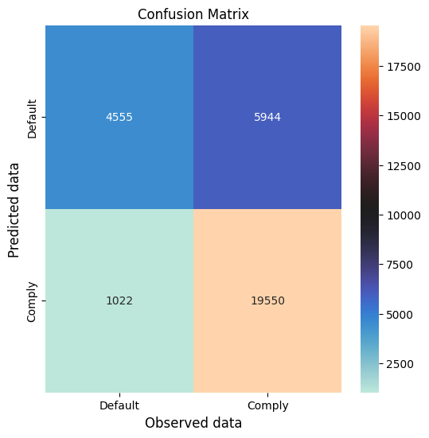
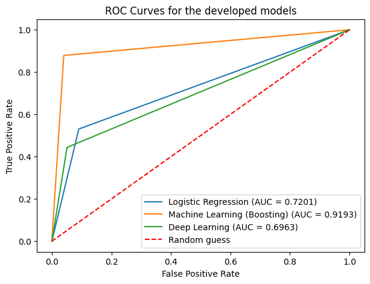

# Task 1
## Make a preliminary statistical analysis of the credit dataset

The following tables describe the statistical analysis for both classes of features, namely numerical features and 
categorical features, that were made available in the original (raw) dataset before any data wrangling done.

**Statistical summary of the numerical features**:

|  | loan_amnt |  funded_amnt |  funded_amnt_inv |    int_rate |  installment |
| --- | --- | --- | --- | --- | --- |
| count | 331304.0000 |  331304.0000 |      331304.0000 | 331304.0000 |  331304.0000 |   
| mean |   15485.6705 |   15485.6705 |       15479.0312 |     12.5709 |     452.0909 |   
| std |     9182.7264 |    9182.7264 |        9181.2607 |      4.6853 |     264.2243 |   
| min |     1000.0000 |    1000.0000 |         725.0000 |      5.3200 |      14.7700 |   
| 25% |     8100.0000 |    8100.0000 |        8100.0000 |      8.8100 |     259.2400 |   
| 50% |    14000.0000 |   14000.0000 |       14000.0000 |     11.9900 |     387.1500 |   
| 75% |    20700.0000 |   20700.0000 |       20675.0000 |     15.3100 |     602.3000 |   
| max |    40000.0000 |   40000.0000 |       40000.0000 |     30.9900 |    1618.2400 |   

|  | annual_inc |         dti |  delinq_2yrs |  inq_last_6mths |    open_acc |
| --- | --- | --- | --- | --- | --- |
| count |  331304.0000 | 331138.0000 |  331304.0000 |     331303.0000 | 331304.0000 |   
| mean |   80425.2580 |     19.0286 |       0.3369 |          0.6083 |     11.8598 |   
| std |     91150.7789 |     12.5358 |       0.9184 |          0.8880 |      5.7909 |   
| min|         0.0000 |     -1.0000 |       0.0000 |          0.0000 |      0.0000 |   
| 25% |     48000.0000 |     12.0500 |       0.0000 |          0.0000 |      8.0000 |   
| 50% |     67314.0000 |     18.1900 |       0.0000 |          0.0000 |     11.0000 |   
| 75% |     95000.0000 |     25.0900 |       0.0000 |          1.0000 |     15.0000 |   
| max |   9757200.0000 |    999.0000 |      21.0000 |          5.0000 |     81.0000 |   

|   |       pub_rec |    revol_bal |  revol_util |   total_acc |   out_prncp | 
| --- | --- | --- | --- | --- | --- |
| count | 331304.0000 |  331304.0000 | 331074.0000 | 331304.0000 | 331304.0000 |  
| mean    |   0.2468 |  16049.1716   |  48.5172   |  24.8545 |   678.8532   |
| std     |   0.6682 |  23183.3434   |  24.8231   |  12.3119  | 3493.3046   |
| min     |   0.0000 |      0.0000   |   0.0000   |   2.0000   |   0.0000   |
| 25%     |   0.0000 |   5507.0000   |  29.6000   |  16.0000   |   0.0000   |
| 50%     |   0.0000 |  10583.0000   |  48.0000   |  23.0000   |   0.0000   |
| 75%     |   0.0000 |  19084.0000   |  67.3000   |  32.0000   |   0.0000   |
| max     |  86.0000 | 1044210.0000  |  182.8000  |  176.0000 | 40000.0000   |

|    |   total_pymnt |      target |
| --- | --- | --- |
| count | 331304.0000 | 310679.0000  |
| mean  |  13235.1261 |     0.3337  |
| std   |  10045.6296 |     0.4715  |
| min   |      0.0000 |     0.0000  |
| 25%   |   5593.8933 |     0.0000  |
| 50%   |  10584.4760 |     0.0000  |
| 75%   |  18391.8971 |     1.0000  |
| max   |  59808.2621 |     1.0000  |

**Statistical summary of the categorical features**:

|   |             term |   grade | emp_title | emp_length | home_ownership |
| --- | --- | --- | --- | --- | --- |
| count  |    331304 | 331304 |   300514  |   307479   |      331304  |  
| unique |         2  |     7  |   90441  |       11    |          4  |  
| mode   |  36 months |      B  | Teacher | 10+ years   |    MORTGAGE  |  
| freq   |    230667  | 98290    |  6412  |   109514    |     164411  |  

|   |        verification_status | issue_d   |          purpose | addr_state |
| --- | --- | --- | --- | --- |
| count  |             331304 | 331304      |        331304   |  331304   |
| unique |                  3  |    11      |            13   |      50   |
| mode    |    Source Verified | Mar-16 | debt_consolidation  |       CA   |
| freq    |            133327 |  56649   |           189096  |    46585   |

|   |        earliest_cr_line | loan_status |  
| --- | --- | --- |
| count  |          331304   |   310704  |  
| unique |             685   |        6  |  
| mode  |            Sep-04  | Fully Paid |  
| freq |              2603   |   207036 |

# Preliminary work
## Before training models
Some adjustments to the dataset must be made before this data can be used to train the models. Verification and adjustment of missing values, correct assignment of data type for some features that are incorrect (dates and integers), correction of some target observations and creation of new features (feature engineering) are done beforehand.

Once the dataset is wrangled and cleaned, the categorical variables undergo One Hot Encoding process using the scikit-learn library, in order to transform the observations in these categories into dummy variables so that they can be used correctly for fitting and predictions by the model algorithms.

The data is then segregated into three distinct groups: validation data (10% of the total), training data (72% of the total), and test data (18% of the total). The training data is used for the effective training of the models, and the test data is used to estimate the predictive power of each model and make the necessary adjustments to the algorithms' hyperparameters. The validation data, in turn, serves to compare the results obtained with predictions simulating real-world data, once the hyperparameters are aligned, in order to avoid overfitting resulting from the over-tuning of the hyperparameters.

# Task 2
## Develop a logistic regression model

The logistic regression model uses the `LogisticRegression` algorithm from the `scikit-learn` library, obtaining Accuracy metric results of 0.7831 (test data) and 0.7833 (validation data). The confusion matrices and the resulting metrics for each dataset are shown below.

**Confusion Matrix for test data using the logistic regression model**\

Model analytics for test data:\
Accuracy: 0.783182\
Sensitivity/Recall: 0.530680\
Specificity: 0.909449\
Precision: 0.745592

**Confusion Matrix for validation data using the logistic regression model**\

Model analytics for validation data:\
Accuracy: 0.783335\
Sensitivity/Recall: 0.539480\
Specificity: 0.907787\
Precision: 0.749107 

# Task 3
## Develop a machine learning model

The machine learning uses the `CatBoost` library, with the `CatBoostClassifier` algorithm, obtaining Accuracy metric results of 0.9328 (test data) and 0.8894 (validation data). The confusion matrices and the resulting metrics for each dataset are shown below.

**Confusion Matrix for test data using the machine learning (CatBoost) model**\

Model analytics for test data:\
Accuracy: 0.932877\
Sensitivity/Recall: 0.878620\
Specificity: 0.960009\
Precision: 0.916573

**Confusion Matrix for validation data using the machine learning (CatBoost) model**\

Model analytics for validation data:\
Accuracy: 0.889447\
Sensitivity/Recall: 0.819888\
Specificity: 0.924947\
Precision: 0.847912

# Task 4
## Develop a deep learning model

The deep learning relies on the `TensorFlow` package, using an input layer, two hidden layers (one dropout and one activation layer) and an output layer, obtaining Accuracy metric results of 0.7711 (test data) and 0.7637 (validation data). The confusion matrices and the resulting metrics for each dataset are shown below.

**Confusion Matrix for test data using a deep neural network (TensorFlow) model**\

Model analytics for test data:\
Accuracy: 0.771112\
Sensitivity/Recall: 0.374973\
Specificity: 0.969208\
Precision: 0.858951

**Confusion Matrix for validation data using a deep neural network (TensorFlow) model**\

Model analytics for validation data:\
Accuracy: 0.763702\
Sensitivity/Recall: 0.363273\
Specificity: 0.968063\
Precision: 0.853053\

# Task 5
## Evaluate the models result (predictive power)
For the purposes of analyzing and comparing the models, metrics based on the Confusion Matrix are used, we rely in the following metrics:
accuracy, sensitivity (recall), specificity, and precision, in addition to the Confusion Matrix itself. The same standard cutoff (0.5) was always used for all trained models: the cutoff is the decision threshold at which the algorithm classifies a binary problem into one class or another.

Regarding the cut-off levels used, the figure below displays the individual ROC curves for each of the three trained models, using test data for comparison, as well as the reference line equivalent to a random guess classification (the dashed line).

There are two basic types of errors possible when analyzing any Confusion Matrix, defined as type I errors and type II errors. The first results from a classification error in which an observation is classified as positive when it should be correctly classified as negative (false positive), while a type II error occurs when an observation is classified as negative instead of being correctly classified as positive (false negative).

In the context of this analysis, then, a type I error occurs when a credit proposal (an observation in the dataset) is incorrectly classified as likely to default (which would not prove to be true), and a type II error occurs when it is classified as a 'good customer', with a low risk of default, and which would prove to be in default in the future. Depending on economic policy or corporate governance itself, the institution has the freedom to modify the cutoff parameter to values ​​different from the standard, so that the credit model used allows for a more biased approach to one of the two errors.

Type I errors may be better suited for well stablished institutions, which can afford to not make some profit while mantaining a good risk management strategy, while type II errors may be better suited for those financial institutions that are trying to expand their customer base and their potential profits, even if it's through incurring in a marginal greater risk.

These are the aggregated four metrics from each model comparing with test data:
| Model | Accuracy | Sensitivity | Specificity | Precision |
| --- | --- | --- | --- | --- |
|          Logistic Regression |   0.7832  |     0.5307 |      0.9094 |    0.7456 |
|  Machine Learning (Boosting) |   0.8894  |     0.8199 |      0.9249 |    0.8479 |
|          Deep Neural Network |   0.7806  |     0.4435 |      0.9491 |    0.8133 |

Considering only the Accuracy metric as a determinant of a model's predictive power, then clearly the Machine Learning (Boosting) model stands out in relation to the other two. In this study, this model also surpasses the others in regards of the Sensitivity and Precision metrics. For the Specificity metric the best performing model was the Deep Neural Network one.

Regarding the neural network models, the scientific literature indicates that these models rely heavily in great volumes of data (although without pointing out what is assumed to be a great volume of data) and this factor can explain why the neural network model had a fairly worse performance among the three models.